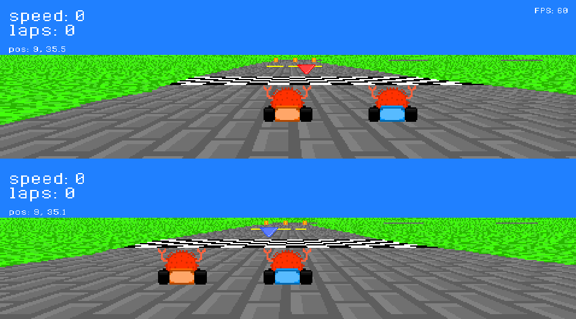
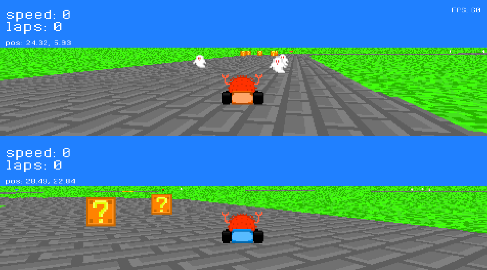
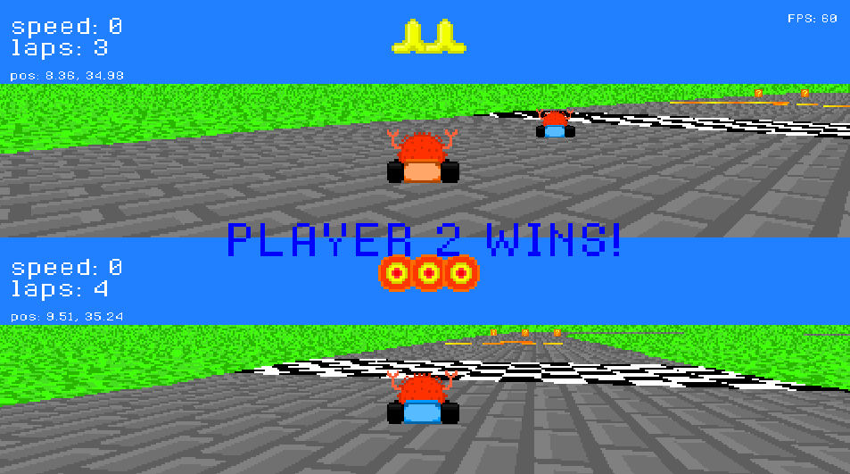

# Krab Kart
Simple racing game written in Rust.

Play as [Ferris](https://rustacean.net/) the crab and race your friend in this 
(sort of fun) split screen racing game! 

This game was created in an attempt to learn more about Rust as a programming
language so the code might not be very well written/best practice and I currently
have no plans of continuing this project at the moment.

This game uses Mode 7 graphics to create a psuedo-3D plane that the player can
race upon and it is entirely software rendered at 480 x 270 resolution.
(Note that since this game is software rendered that CPU usage might be sort of
high at times)

## Build from source
You will need [SDL2](https://github.com/libsdl-org/SDL/releases/tag/release-2.26.5) 
and [SDL2-ttf](https://github.com/libsdl-org/SDL_ttf/releases/tag/release-2.20.2) 
as dependencies on your system to properly
build the game - I have tested compiling it on Windows and Linux but not
on any other operating system.

If you want best performance, compile with `cargo build --release`.

## How to play
Arrow keys to control the top crab, WASD to control the bottom crab.

### Top Crab
- Up arrow accelerates the top crab
- Left arrow/Right arrow rotates the top crab
- Down arrow is the use powerup button for the top crab

### Bottom Crab
- W accelerates the bottom crab
- A/D rotates the bottom crab
- S is the user powerup button for the bottom crab

First one to 4 laps wins!

## Screenshots

## License

Apache 2.0
